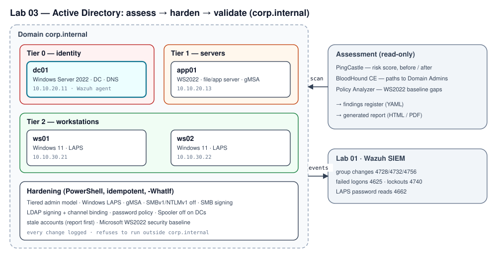

# Lab 03 — Active Directory: assess, harden and validate

Defensive-first Active Directory lab for a fictional 40-person company (`corp.internal`): documented baseline
weaknesses, assessment with PingCastle, BloodHound CE and Microsoft's security baseline, hardening as
PowerShell scripts, before/after scores and a generated assessment report.

> **Work in progress:** the Pester tests for the PowerShell scripts are written but have not passed yet (their
> first CI run is pending, and a review found fixes to make first). The Python tooling is tested in CI. See the
> open items in the write-up's roadmap before using the scripts, even in a lab.

**Category:** Vulnerability Assessment & Pentesting · **Status:** reference design — ready to build



## Repository layout
```
docs/build.md, docs/weaknesses.md   build the domain; the 11 baseline weaknesses (W01-W11)
docs/assessment/                    PingCastle, BloodHound CE, Policy Analyzer guides
docs/siem-checks.md                 events to confirm in Wazuh (Lab 01)
scripts/LabCommon.psm1              domain guard, change log, GPO registry helper
scripts/build/                      domain structure (OUs, groups, users)
scripts/harden/                     one idempotent, -WhatIf-aware script per control
findings/findings.yaml              findings register (drives the report)
adlab/                              findings model, PingCastle score parser, report generator (Python)
report/                             report template and generated report (HTML; PDF is git-ignored)
tests/python, tests/powershell      pytest suite (CI) and Pester 5 suite (not yet passing)
evidence/                           tool exports (git-ignored until sanitized)
```

## Usage
```bash
python -m pip install -r requirements-dev.txt
python -m pytest                                          # Python tests
python -m adlab.findings findings/findings.yaml --check-scripts
python -m adlab.scores                                    # PingCastle before/after table (Pending until exports exist)
python -m adlab.report --pdf                              # assessment report (Draft until measured)
```
PowerShell tests: `Invoke-Pester tests/powershell` (Pester 5).

> All testing is performed only in an isolated lab environment I own. The repository automates fixes only; it
> contains no code that weakens a domain or exploits one.

## License
[MIT](LICENSE)
